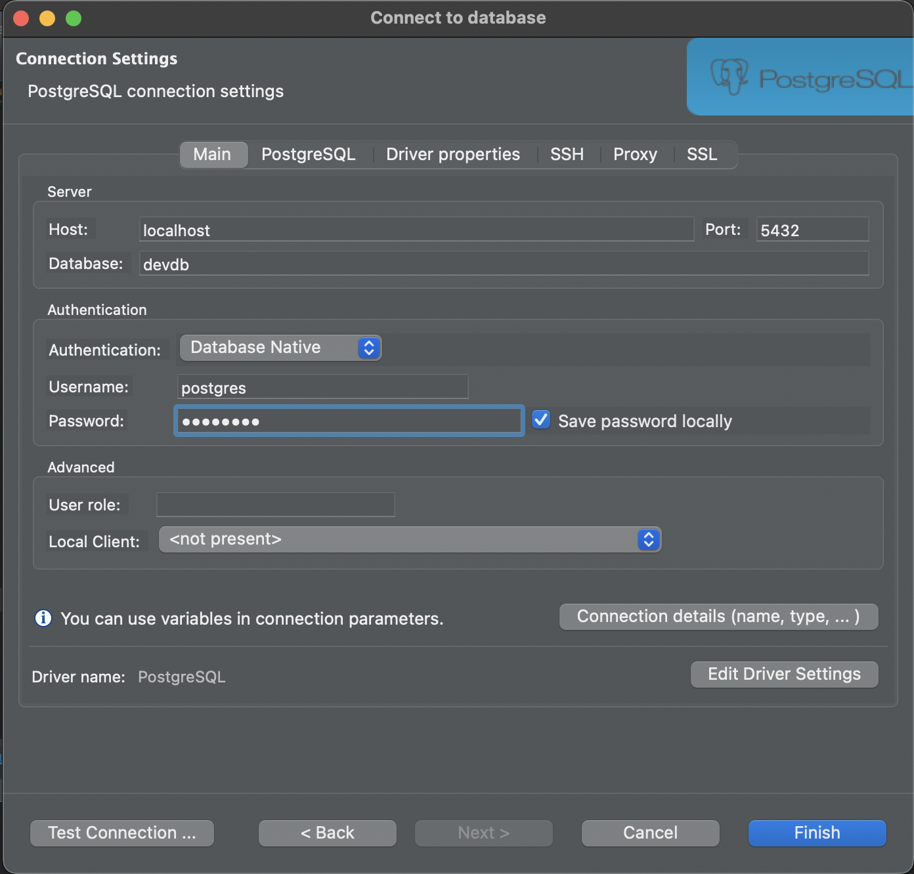

# About

API for split expense

# Local setup

Application is built using [Python](https://www.python.org/) & [Flask-RESTplus](https://flask-restplus.readthedocs.io/en/stable/) as the backend and [React library](https://reactjs.org/) for the front end. following are the steps required to setup the application in local computer

## Backend setup

Backend application uses Postgres as the dependency, follow the steps to install the Postgres through Docker

### Application dependencies setup

1. Install the stable latest [Docker](https://www.docker.com/products/docker-desktop) in your computer
2. Pull the Postgres DB image using the following command

   `docker pull postgres`

3. Create the Postgres container using the following command

   `docker run --name postgres-container-with-persistence -p 5432:5432 -v docker_postgres_dbdata:/var/lib/postgresql/data -e POSTGRES_PASSWORD=password -d postgres`

4. Download the [DBeaver](https://dbeaver.io/) application to connect and view database tables
5. Create a new connection in the dbeaver application, adding the following details

   ```
   host: localhost
   port: 5432
   Database: devdb
   username: postgres
   password: password
   ```

   

   Note: Make sure devdb is already created and check connection via dbeaver

### Installation of Application library Requirements

Application requirements can be install current system python runtime or we can create a virtual environment. In this local setup we will be using the anaconda environment for our setup

1. Install [Anaconda(individual edition)](https://www.anaconda.com/products/individual)
2. create virtual environment using the following command

   `conda create -n expense python=3.7`

3. activate the environment using the conda activate method

   `conda activate expense`

4. navigate to split_expense_api folder and install the requirement.txt libraries using the following command

   `pip install -r requirements.txt`

### Configuring the pycharm

1. Download and install [Pycharm(community edition)](https://www.jetbrains.com/pycharm/download/) application
2. open the split-expense project in the pycharm
3. Change the interpreter settings by going to - preferences
   - project: split-expense
   - python interpreter
   - click on gear icon and select add interpreter
   - select conda environment
   - select exisiting environment and choose 'expense' from list.

### Executing the application

run the application by executing the file server.py

### Executing application via Docker

To Execute the backend application via Docker, make sure docker is installed in your system.

1. execute the following command in terminal after navigating to the project root folder
   ```
   docker-compose up -d --build
   ```
2. open localhost:5000/api to use the backend api
